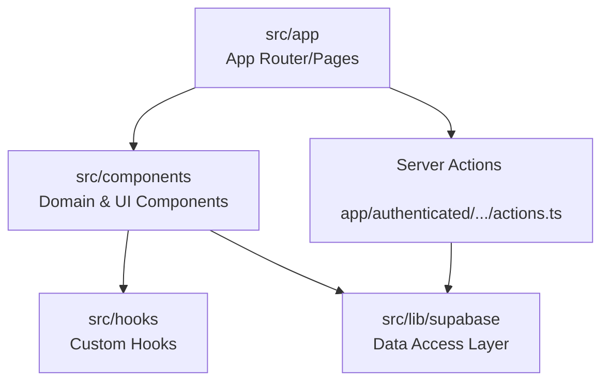

# Budget Lens - Gemini / Antigravity 開発ガイド

このファイルは、本プロジェクトで作業する Gemini および Antigravity エージェント向けの開発手順、ディレクトリ構造、業務仕様、実装ルールをまとめたものです。

## 0. AIへの指示 (AI Instructions)
- **応答言語**: ユーザーへの回答や対話は、原則として**常に日本語**で行ってください。(Please always respond to the user in Japanese.)
- **コードフォーマットの徹底**: コードの記述や修正を行った後は、完了する前に必ずフォーマッタやLinter（`pnpm format:biome` や `pnpm lint` など）を実行し、コードを綺麗に整形・チェックしてください。

---

## 1. 主要な技術スタックとバージョン
- **Next.js**: v16.2.9 (App Router 使用)
- **React**: v19.2.4
- **パッケージマネージャー**: `pnpm` (v10.15.1)
- **データベース / 認証**: Supabase
- **スタイリング**: Tailwind CSS v4.3.1
- **UIライブラリ**: shadcn/ui (Base UI / Radix UI ラッパー)

---

## 2. ディレクトリ構造と各層の役割

`src/` 配下を中心に、以下のように役割と責務が分担されています。

| ディレクトリパス | 役割と責務 |
| :--- | :--- |
| [src/app/](file:///Users/temmy/budget-lens/budget-lens/src/app) | **App Router エントリーポイント** 各パスに対応する `page.tsx` やレイアウト（`layout.tsx`）を配置。認証状態に応じて `(authenticated)` グループと `login` ディレクトリに大別されます。 |
| [src/components/](file:///Users/temmy/budget-lens/budget-lens/src/components) | **UIコンポーネント層** ドメイン毎（`budgets`, `dashboard`, `expenses`, `history`）にフォルダ分けされています。共通で使用する汎用コンポーネント（DatePickerやSelect等）は `ui/` に配置されます。 |
| [src/hooks/](file:///Users/temmy/budget-lens/budget-lens/src/hooks) | **カスタムフック層** 認証情報などの横断的な状態や処理ロジックをカプセル化するカスタムフックを配置します。 |
| [src/lib/](file:///Users/temmy/budget-lens/budget-lens/src/lib) | **ユーティリティ＆ライブラリ接続層** 外部サービス（Supabase等）のクライアント初期化や共通ユーティリティ関数（`utils.ts`）を配置します。 |

---

## 3. 主要機能の配置ルール

新しい機能を追加・改修する際は、以下の配置構成に従ってください。

* **共通コンポーネント**:
  * [src/components/ui/](file:///Users/temmy/budget-lens/budget-lens/src/components/ui) 配下（例: [select.tsx](file:///Users/temmy/budget-lens/budget-lens/src/components/ui/select.tsx), [date-picker.tsx](file:///Users/temmy/budget-lens/budget-lens/src/components/ui/date-picker.tsx) など）
* **カスタムフック**:
  * [src/hooks/](file:///Users/temmy/budget-lens/budget-lens/src/hooks) 配下（例: [use-current-user.ts](file:///Users/temmy/budget-lens/budget-lens/src/hooks/use-current-user.ts) - ログイン中ユーザー情報の取得）
* **API処理・データアクセス層 (DAL)**:
  * [src/lib/supabase/](file:///Users/temmy/budget-lens/budget-lens/src/lib/supabase) 配下にエンティティ毎のCRUD操作関数を定義。
  * [client.ts](file:///Users/temmy/budget-lens/budget-lens/src/lib/supabase/client.ts) (クライアント用)、[server.ts](file:///Users/temmy/budget-lens/budget-lens/src/lib/supabase/server.ts) (サーバー用) を使い分けます。
* **Server Actions**:
  * 各ページの機能ディレクトリ内に `actions.ts` として配置します（例: [budgets/actions.ts](file:///Users/temmy/budget-lens/budget-lens/src/app/(authenticated)/budgets/actions.ts)）。
* **型定義 (Types)**:
  * 各機能フォルダ内の `types.ts` 配下に配置します（例: [budgets/types.ts](file:///Users/temmy/budget-lens/budget-lens/src/components/budgets/types.ts)）。

---

## 4. コードベースから読み取る主要な仕様・業務ルール

### ① 認証とセッション管理
* **仕組み**: Supabase Auth を使用して認証を行っています。
* **セッション維持**: [src/proxy.ts](file:///Users/temmy/budget-lens/budget-lens/src/proxy.ts) が Next.js ミドルウェアのような中継を行い、[middleware.ts](file:///Users/temmy/budget-lens/budget-lens/src/lib/supabase/middleware.ts) を通じてリクエスト毎にセッショントークンを最新化・維持しています。

### ② 予算履歴（過去月振り返り）とスナップショット
* **業務ルール**: 
  * 現在の月より未来の月（来月以降）は履歴の振り返り対象外となります。
  * ユーザーが現在の予算設定を変更しても過去の予算消化状況に影響を与えないよう、予算設定を追加・更新・削除するすべての操作において、**その時点での全予算設定 of その時点での全予算設定の「スナップショット」を JSON 形式で `budget_histories` テーブルに保存**します（[budgets/actions.ts](file:///Users/temmy/budget-lens/budget-lens/src/app/(authenticated)/budgets/actions.ts) 内の `saveBudgetHistorySnapshot` を参照）。
  * 過去の月（履歴）を表示する際は、該当月末時点より前に保存された最新のスナップショットデータを `budget_histories` から取得し、当時の予算設定を復元して表示します（[history.ts](file:///Users/temmy/budget-lens/budget-lens/src/lib/supabase/history.ts) 内の `getHistoryData` を参照）。

### ③ 支出（出費）管理のバリデーションとルール
* **未分類**: 予算カテゴリ（`budgetId`）が未指定または空文字 (`""`) の出費データは、「未分類」カテゴリとしてマッピング・集計されます。
* **カテゴリ削除のブロック**: すでに出費（Expense）レコードに紐づいている予算カテゴリは、出費データとの整合性を保つため削除できません（[budgets.ts](file:///Users/temmy/budget-lens/budget-lens/src/lib/supabase/budgets.ts) の `deleteBudget` 内で存在チェックを行っています）。
* **バリデーションルール**:
  * ログイン用スキーマは Zod ([LoginFormSchema](file:///Users/temmy/budget-lens/budget-lens/src/app/login/schemas.ts)) を使用（メール形式チェック、パスワード6文字以上制限）。
  * 出費入力時は、カテゴリの必須選択、金額は1円以上の整数のみ許可などの手動チェックが実装されています。

### ④ キャッシュ再検証
* **ルール**: データ追加・変更操作を伴う Server Actions の実行後は、必ず `revalidatePath("/budgets")` などを利用して Next.js のデータキャッシュを強制的に更新（再検証）します。

---

## 5. 今後開発を進める上で参照・修正すべき主要ファイル

| 改修したい機能 | 主に参照・修正するファイル |
| :--- | :--- |
| **予算カテゴリ（追加・更新・削除）** | ・[budgets/actions.ts](file:///Users/temmy/budget-lens/budget-lens/src/app/(authenticated)/budgets/actions.ts) (Server Actions) • [budgets.ts](file:///Users/temmy/budget-lens/budget-lens/src/lib/supabase/budgets.ts) (データアクセス層) • [budgets-client.tsx](file:///Users/temmy/budget-lens/budget-lens/src/components/budgets/budgets-client.tsx) (UI状態管理) |
| **出費データ（追加・更新・削除）** | ・[expenses.ts](file:///Users/temmy/budget-lens/budget-lens/src/lib/supabase/expenses.ts) (データアクセス層) • [expenses-client.tsx](file:///Users/temmy/budget-lens/budget-lens/src/components/expenses/expenses-client.tsx) (UI状態管理) • [expense-form-modal.tsx](file:///Users/temmy/budget-lens/budget-lens/src/components/expenses/expense-form-modal.tsx) (入力・編集フォーム) |
| **カテゴリ絞り込み（フィルター）** | ・[expense-list.tsx](file:///Users/temmy/budget-lens/budget-lens/src/components/expenses/expense-list.tsx) (表示フィルター・プルダウンUI) |
| **過去履歴（年別・月別・スナップショット）** | ・[history.ts](file:///Users/temmy/budget-lens/budget-lens/src/lib/supabase/history.ts) (データアクセス層) • [history-client.tsx](file:///Users/temmy/budget-lens/budget-lens/src/components/history/history-client.tsx) (履歴UI) |

---

## 6. よく使うコマンド

- **開発サーバー起動**: `pnpm dev` （ポート `3005` で起動）
- **本番用ビルド**: `pnpm build`
- **本番サーバー起動**: `pnpm start` （ポート `3005` で起動）
- **静的解析 (Linter)**: `pnpm lint`
- **コード整形 (Biome)**: `pnpm format:biome` (または `pnpm lint:biome`)

---

## 7. スタイリングに関する重要事項 (Tailwind CSS v4)
- **注意**: Tailwind CSS v4 が導入されており、テーマのカスタマイズは [globals.css](file:///Users/temmy/budget-lens/budget-lens/src/app/globals.css) 内の `@theme inline` ブロックで定義されます。**`tailwind.config.js` や `tailwind.config.ts` は絶対に作成しないでください。**
