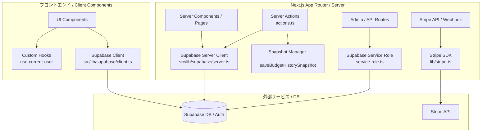

# Budget Lens - アプリケーション実装状況レポート

このドキュメントは、予算・支出管理アプリケーション「**Budget Lens**」の現在の技術スタック、ディレクトリ構造、および各機能の実装状況を網羅的にまとめた最新レポートです。開発の引き継ぎや進捗共有、記録用ドキュメントとしてそのままご利用いただけます。

---

## 1. プロジェクト概要 & 技術スタック

「Budget Lens」は、直感的なUIとリアルタイムな集計機能によって、スマートな予算設計と支出管理、過去実績の振り返りを支援するWebアプリケーションです。

* **フロントエンドフレームワーク**: Next.js v16.2.9 (App Router 構成)
* **ライブラリ**: React v19.2.4
* **パッケージマネージャー**: `pnpm` (v10.15.1)
* **スタイリング**: Tailwind CSS v4.3.1
  * *※`tailwind.config.js` は使用せず、`src/app/globals.css` の `@theme inline` でカスタムテーマを直接定義。*
* **UIライブラリ / アイコン**:
  * shadcn/ui (Base UI `@base-ui/react` / Radix UI)
  * Lucide React (`lucide-react`)
* **アニメーション**: Motion (`motion` v13.1.1)
* **データベース / 認証**: Supabase (`@supabase/supabase-js`, `@supabase/ssr`)
  * PostgreSQL + Row Level Security (RLS)
  * Supabase Auth (メール認証・パスワードリセット・コールバック)
* **決済・サブスクリプション**: Stripe (`stripe` SDK, Checkout Session, Webhook)
* **バリデーション**: Zod (`zod` v4.4.3)
* **コードフォーマッター / Linter**: Biome (`@biomejs/biome` v2.3.8) / ESLint

---

## 2. ディレクトリ構造

`src/` 配下を中心に、関心事の分離（App Router、ドメイン別コンポーネント、データアクセス層）が徹底されています。

```text
src/
├── app/                                    # Next.js App Router ルーティング
│   ├── (authenticated)/                    # ログイン後（認証保護）ルートグループ
│   │   ├── budgets/                        # 予算管理画面 (/budgets)
│   │   │   ├── actions.ts                  # 予算CRUD・スナップショット作成 Server Actions
│   │   │   └── page.tsx
│   │   ├── dashboard/                      # ダッシュボード画面 (/dashboard)
│   │   │   └── page.tsx
│   │   ├── expenses/                       # 支出管理画面 (/expenses)
│   │   │   └── page.tsx
│   │   ├── history/                        # 支出履歴・過去月振り返り画面 (/history)
│   │   │   ├── [year]/                     # 年別・月別詳細画面 (/history/[year])
│   │   │   │   └── page.tsx
│   │   │   ├── actions.ts
│   │   │   ├── loading.tsx                 # 履歴ページ専用ローディングUI
│   │   │   └── page.tsx
│   │   ├── settings/                       # アカウント設定画面 (/settings)
│   │   │   ├── actions.ts
│   │   │   └── page.tsx
│   │   ├── layout.tsx                      # 認証後ページの共通シェル・ナビゲーション
│   │   ├── loading.tsx                     # 認証エリア共通ローディング
│   │   └── page.tsx                        # デフォルトリダイレクト
│   ├── api/                                # APIルート
│   │   ├── stripe/                         # Stripe連携API
│   │   │   ├── checkout/route.ts           # チェックアウトセッション生成
│   │   │   └── webhook/route.ts            # Stripe Webhookイベントハンドラ
│   │   └── user/                           # ユーザー・アカウント操作API
│   │       ├── delete-account/route.ts     # アカウント完全退会・削除API
│   │       └── me/route.ts                 # ログインユーザー情報取得API
│   ├── auth/                               # 認証コールバック
│   │   └── callback/route.ts               # メール認証・パスワードリセット用コールバック
│   ├── forgot-password/                    # パスワード再設定メール送信画面 (/forgot-password)
│   │   ├── actions.ts
│   │   ├── page.tsx
│   │   └── schemas.ts
│   ├── login/                              # ログイン & 新規登録画面 (/login)
│   │   ├── actions.ts
│   │   ├── page.tsx
│   │   └── schemas.ts
│   ├── onboarding/                         # 初回ログイン時オンボーディング画面 (/onboarding)
│   │   ├── actions.ts                      # 初期予算一括セットアップ Server Actions
│   │   └── page.tsx
│   ├── reset-password/                     # 新パスワード設定画面 (/reset-password)
│   │   ├── actions.ts
│   │   ├── page.tsx
│   │   └── schemas.ts
│   ├── subscribe/                          # サブスクリプション加入画面 (/subscribe)
│   │   └── page.tsx
│   ├── globals.css                         # グローバルCSS (Tailwind CSS v4 定義)
│   ├── layout.tsx                          # ルートレイアウト
│   └── page.tsx                            # ランディングページ (LP)
├── components/                             # UIコンポーネント層
│   ├── auth/                               # 認証関連コンポーネント
│   │   ├── forgot-password-client.tsx      # パスワード忘れフォーム
│   │   ├── key-visual.tsx                  # 認証画面用キービジュアル
│   │   ├── login-client.tsx                # ログイン・登録タブ制御
│   │   ├── login-form.tsx                  # ログイン入力フォーム
│   │   ├── reset-password-client.tsx       # 新パスワード再設定フォーム
│   │   ├── signup-form.tsx                 # サインアップ入力フォーム
│   │   └── success-message.tsx             # 完了・案内メッセージ表示
│   ├── budgets/                            # 予算管理コンポーネント
│   │   ├── budget-form.tsx                 # 予算作成・編集フォーム
│   │   ├── budgets-client.tsx              # 予算画面状態管理クライアント
│   │   ├── category-list.tsx               # 予算カテゴリカード一覧
│   │   └── types.ts                        # 予算ドメインの型定義
│   ├── dashboard/                          # ダッシュボードコンポーネント
│   │   ├── dashboard-client.tsx            # ダッシュボード状態管理クライアント
│   │   ├── dashboard-stats.tsx             # 統計カード（残り予算、総支出、手取り収入）
│   │   └── recent-expenses.tsx             # 直近支出一覧コンポーネント
│   ├── expenses/                           # 支出管理コンポーネント
│   │   ├── expense-card.tsx                # 支出項目カード
│   │   ├── expense-form-modal.tsx          # 支出追加・編集モーダルフォーム
│   │   ├── expense-list.tsx                # 支出一覧（カテゴリ絞り込みフィルター付き）
│   │   └── expenses-client.tsx             # 支出画面状態管理クライアント
│   ├── history/                            # 履歴・振り返りコンポーネント
│   │   ├── card-skeleton.tsx               # 履歴用スケルトンローダー
│   │   ├── history-client.tsx              # 履歴一覧（年別切り替え・月カード表示）
│   │   ├── history-month-card.tsx          # 各月実績サマリーカード
│   │   ├── history-detail/                 # 過去月詳細画面コンポーネント
│   │   │   ├── expense-history-list.tsx    # 過去月の支出履歴一覧
│   │   │   └── history-detail-client.tsx   # 過去月詳細クライアント
│   │   └── types.ts                        # 履歴ドメインの型定義
│   ├── navigation/                         # ナビゲーションコンポーネント
│   │   ├── header.tsx                      # 共通ヘッダー（ログアウト処理含む）
│   │   └── sidebar.tsx                     # デスクトップ用サイドバー
│   ├── ui/                                 # 汎用UIパーツ (shadcn/ui ベース)
│   │   ├── category-budget-progress.tsx    # カテゴリ別予算消化進捗バー
│   │   ├── category-spent-chart.tsx        # カテゴリ別支出SVG円グラフ
│   │   ├── date-picker.tsx                 # 日付選択カレンダー
│   │   ├── delete-button.tsx               # 削除ボタン（確認UI付き）
│   │   ├── edit-button.tsx                 # 編集ボタン
│   │   ├── password-input.tsx              # パスワード表示/非表示トグル対応入力欄
│   │   ├── select.tsx                      # セレクトボックス
│   │   └── value-selector.tsx              # 金額・数値セレクター
│   ├── button.tsx                          # 汎用ボタンコンポーネント
│   ├── DeleteAccountButton.tsx             # アカウント完全退会ボタン
│   ├── landing-page-client.tsx             # LP（ランディングページ）クライアント
│   ├── navigation-shell.tsx                # ナビゲーションラッパーシェル
│   └── SubscribeButton.tsx                 # Stripe Checkout 起動ボタン
├── config/                                 # アプリケーション設定
│   └── navigation.tsx                      # サイドバー・ナビゲーション設定項目
├── hooks/                                  # カスタム React フック
│   └── use-current-user.ts                 # ログインユーザー取得・監視フック
├── lib/                                    # 外部サービス接続・ユーティリティ
│   ├── stripe.ts                           # Stripe SDK 初期化・設定
│   ├── subscription.ts                     # サブスクリプション状態判定ロジック
│   ├── utils.ts                            # 共通クラス合成 (cn) ユーティリティ
│   └── supabase/                           # Supabase データアクセス・認証層
│       ├── auth.ts                         # 認証ユーティリティ
│       ├── budgets.ts                      # 予算 CRUD & スナップショット操作
│       ├── client.ts                       # ブラウザ用 Supabase クライアント
│       ├── dal.ts                          # 共通データアクセスレイヤー
│       ├── expenses.ts                     # 支出 CRUD 操作
│       ├── history.ts                      # 履歴データ集計・スナップショット復元
│       ├── middleware.ts                   # セッション更新 & 未ログイン保護ミドルウェア
│       ├── server.ts                       # サーバーサイド用 Supabase クライアント
│       ├── service-role.ts                 # 管理者権限 (Service Role) クライアント
│       └── users.ts                        # ユーザープロファイル・データ操作
├── proxy.ts                                # Next.js ミドルウェア中継
└── types/                                  # グローバル型定義
    ├── auth.ts                             # 認証関連型定義
    └── form.ts                             # フォーム関連型定義
```

---

## 3. 機能別の実装ステータス詳細

### 🚀 3.1. ランディングページ (Landing Page / `/`)
* **サービス訴求 & 特徴紹介**:
  * ファーストビュー、欲望抑制・スマート予算管理のコンセプト説明、機能ハイライトを掲載。
  * `motion` を活用した滑らかなフェードイン・スライドインアニメーションを実装。
  * ログイン / 新規登録画面へのシームレスな誘導ボタンを配置。

### 🔑 3.2. ユーザー認証・アカウント管理 (Authentication & Account)
* **ログイン & サインアップ統合UI (`/login`)**:
  * タブ切り替え形式でログイン・新規登録フォームをひとつの画面で提供。
  * パスワード表示/非表示切り替えボタン（`password-input.tsx`）を標準搭載。
  * フォーム送信中の多重送信防止（disabled制御・ローディング状態）を実装。
* **パスワード再設定フロー (`/forgot-password` & `/reset-password`)**:
  * パスワードを忘れた場合のメール送信機能（`/forgot-password`）。
  * メール内のリンク経由で `/auth/callback` を通過し、安全に新しいパスワードを設定するUI（`/reset-password`）。
* **初回オンボーディングウィザード (`/onboarding`)**:
  * 新規登録完了後、初期セットアップをガイドする専用ウィザード画面。
  * 代表的な予算カテゴリの初期設定などをスムーズに行い、すぐにアプリを利用開始可能。
* **アカウント退会機能 (`/settings` & `/api/user/delete-account`)**:
  * 設定画面からユーザー自身によるアカウント完全退会（ユーザーデータおよび Supabase Auth アカウントの削除）が可能。
  * 管理者権限（`service-role.ts`）を介して安全にアカウント抹消処理を実行。
* **ルート保護 & セッション更新 (Middleware & Proxy)**:
  * `src/proxy.ts` と `src/lib/supabase/middleware.ts` により、未ログイン時の保護されたページ（`/dashboard`, `/budgets`, `/expenses`, `/history` 等）へのアクセスを自動で `/login` へリダイレクト。
  * トークンの自動リフレッシュによるセッション永続化。

### 📊 3.3. ダッシュボード (Dashboard / `/dashboard`)
* **クイック統計カード**:
  * 「今月の残り予算（全体予算に対する未消化割合）」、「今月の総支出（前月比%の算出付き）」、「今月の手取り収入」をリアルタイム集計して表示。
  * 全体消化状況をプログレスバーで可視化。
* **カテゴリ別支出割合（SVGドーナツ円グラフ）**:
  * 当月の支出データをカテゴリごとに集計し、SVGドーナツチャートとして描画。
  * 予算カテゴリに設定されたグラデーションカラー（Tailwind）をSVGグラデーションタグにマッピングし、鮮やかなグラデーション表示を実現。
* **直近の支出履歴**:
  * 登録された最新の支出レコードを最大4件までリスト表示。

### 💰 3.4. 予算設定 (Budgets / `/budgets`)
* **予算カテゴリ管理 (CRUD)**:
  * ユーザーごとに任意のカテゴリ（食費、日用品、家賃、娯楽など）を作成可能。
  * カテゴリ名、月間予算（金額）、およびカラーパレット（グラデーション配色）を自由に編集・削除可能。
* **スナップショット自動保存 (`budget_histories`)**:
  * ユーザーが予算を追加・編集・削除したタイミングで、**その時点での全予算設定のスナップショット（JSON）を `budget_histories` テーブルに自動保存**。
  * 過去の月の振り返り時に、当時の予算設定を正確に復元する基盤を構築。
* **支出紐付き時の整合性保護**:
  * すでに出費レコードが存在するカテゴリの削除をブロックし、データ不整合を防止。

### 💸 3.5. 支出管理 (Expenses / `/expenses`)
* **出費の記録・編集・削除**:
  * 金額、利用日、カテゴリ、メモ（任意）を入力可能なモーダルフォーム（`expense-form-modal.tsx`）。
* **カテゴリ絞り込み（フィルター機能）**:
  * ドロップダウンによるカテゴリ別絞り込み表示に対応。
* **当月出費一覧 & 来月以降の予想出費一覧**:
  * 当月分の支出一覧表示に加え、未来日付で登録された固定費・予定引き落としを「予想出費」として別枠で集計・一覧化。
* **予算消化状況プログレスバー**:
  * 各カテゴリごとに当月の支出合計と予算消化率をバー表示。
  * 予算上限を超過した場合は警告カラー（赤色）へ自動変化。

### 📅 3.6. 支出履歴・過去月振り返り (History / `/history` & `/history/[year]`)
* **年別・月別履歴カード一覧 (`/history`)**:
  * 過去の実績を年ごとにタブ切り替え表示。
  * 各月カードに「総支出」「予算消化率」「主要カテゴリ支出」のサマリーを表示。
* **スナップショット復元による正確な振り返り**:
  * 該当月の月末時点より前に保存された最新のスナップショットを `budget_histories` から抽出し、**「その月当時の予算設定」と実際の支出データを突き合わせて完全再現**。
* **月別詳細画面 (`/history/[year]`)**:
  * 該当月の全支出内訳とカテゴリ別詳細を確認可能。
* **ローディング・スケルトン対応**:
  * 履歴取得専用のスケルトンカード（`card-skeleton.tsx`）や `loading.tsx` を整備し、待ち時間のUXを向上。

### 💳 3.7. 決済・サブスクリプション (Stripe / `/subscribe` & `/api/stripe/...`)
* **Stripe Checkout 連携**:
  * 有料プラン加入用画面（`/subscribe`）と `SubscribeButton.tsx` を実装。
  * `/api/stripe/checkout` を通じて Stripe のセッションを生成し、安全な決済画面へ遷移。
* **Stripe Webhook ハンドリング**:
  * `/api/stripe/webhook` により、サブスクリプション作成・更新・キャンセルイベントを受信し、ユーザーの利用ステータスを自動更新。

### 🎨 3.8. UI/UX・アニメーション・共通設計
* **モダンなデザインシステム**:
  * Tailwind CSS v4 のインラインテーマによる洗練された配色・ダーク調UI。
* **マイクロインタラクション & アニメーション**:
  * `motion` によるスムーズな画面遷移・モーダルアニメーション。
* **ローディング・フィードバック**:
  * ログアウト時ローディング、データ取得中スケルトン画面、ボタンの多重送信防止処理。

---

## 4. データアクセスとアーキテクチャの仕組み



* **安全なクライアント/サーバー分離**:
  * クライアント側は `createBrowserClient`、Server Component / Server Actions 側は `createServerClient`、管理者処理は `service-role.ts` に厳格に分離。
* **キャッシュ再検証 (Revalidation)**:
  * データの変更（追加・編集・削除）を伴う操作後は、Next.js の `revalidatePath` を呼び出して即座に最新データを反映。
* **並行データ取得**:
  * 画面ロード時に `Promise.all` を活用し、予算と支出の並行フェッチによりレイテンシを最小化。

---

## 5. 主要なコマンド一覧

| コマンド | 内容 |
| :--- | :--- |
| `pnpm dev` | 開発サーバー起動（デフォルトポート: **3005**） |
| `pnpm build` | 本番用ビルド |
| `pnpm start` | 本番用サーバー起動（ポート: **3005**） |
| `pnpm lint` | ESLint による静的解析 |
| `pnpm lint:biome` | Biome によるチェック |
| `pnpm format:biome` | Biome によるコード自動フォーマット |
| `pnpm stripe:listen` | Stripe Webhook ローカル受信用リスナー起動 |
| `pnpm supabase:deploy` | Supabase データベースマイグレーションのデプロイ |
| `pnpm supabase:seed` | 初期シードデータの投入 |
